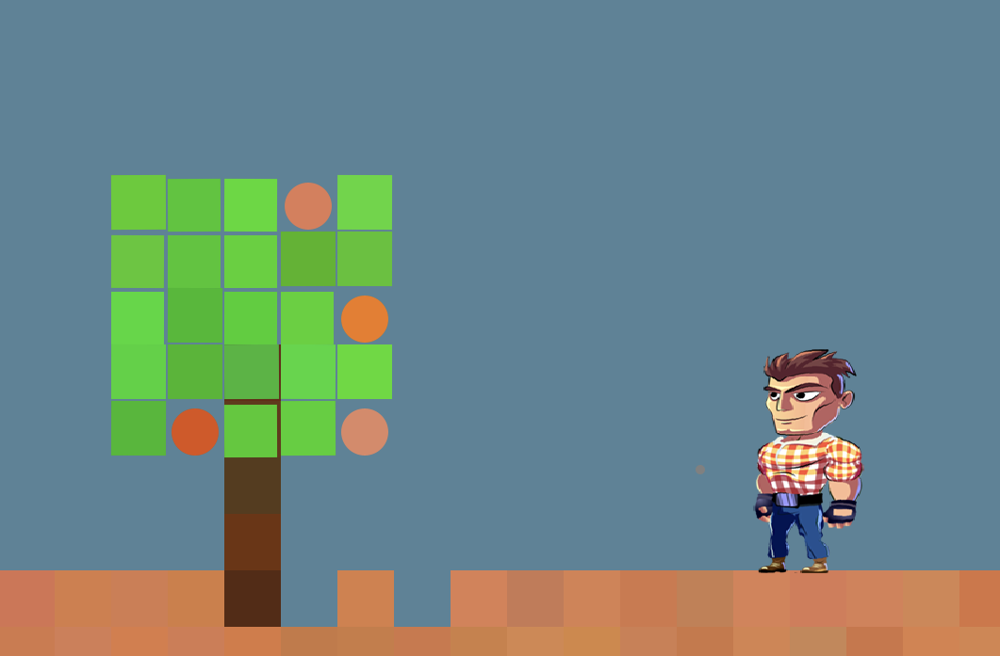

# Pepse – 2D Infinite World Game

Small Java game built on top of DanoGameLab: procedural terrain, trees, fruits, simple weather, and a controllable avatar in an infinite side-scrolling world.




---

## Features

- Infinite terrain chunks with noise-based generation
- Day–night cycle (sun, halo, night overlay)
- Trees with animated leaves and collectible fruits
- Weather effects (clouds + rain tied to jumps)
- Energy bar UI with idle/run/jump feedback

---

## Controls

- `←` / `→` – move
- `Space` – jump

---

## Requirements

- Java JDK 17+
- `make` (macOS / Linux)
- `lib/DanoGameLab.jar` (included under `lib/`)

---

## Build & Run (macOS / Linux)

```bash
git clone https://github.com/yazanzaid00/pepse-game.git
cd pepse-game
make run
```

Useful targets:

* `make` – compile into `bin/`
* `make run` – compile + run
* `make clean` – remove build artifacts

---

## Build & Run (Windows)

Use the bundled script:

```bat
git clone https://github.com/yazanzaid00/pepse-game.git
cd pepse-game
run_windows.bat
```
---

## Project Structure

* `pepse/` – game logic (avatar, terrain, trees, weather, UI, infinite world)
* `assets/` – sprite images for the avatar and world
* `lib/DanoGameLab.jar` – DanoGameLab engine dependency
* `media/` – GIFs / screenshots (e.g., `pepse-gameplay.gif`)
* `Makefile` / `run_windows.bat` – build + run helpers
* `README.md` – this file

---

## Notes & Credits

* Uses the DanoGameLab framework and utilities.
